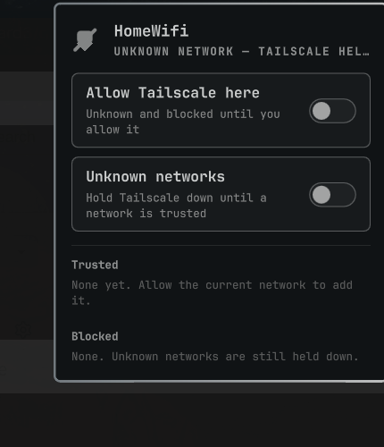

# Tailnet Guard

Some networks treat Tailscale as a VPN and will block the whole machine if they see it. This Omarchy plugin maps Wi-Fi (and Ethernet) networks to whether Tailscale is safe, and **takes Tailscale down as soon as you leave a network** — before the next one associates.

Unknown networks keep Tailscale off. Mark the ones you trust.



## Install

Requires [Tailscale](https://tailscale.com) and NetworkManager (`nmcli`). The plugin installs a **user** systemd unit only — no root, no sudoers.

```bash
omarchy plugin add https://github.com/Howard3/omarchy-tailnet-guard.git --enable
```

Then click the shield in the bar (next to Tailscale) and turn on **Allow Tailscale here** for networks you trust.

## Behaviour

- **Between networks / sleep / no connection:** `tailscale down` immediately (fail closed)
- **SSID (or Ethernet connection name) in the trusted list:** `tailscale up`
- **In the blocked list, or unknown with the default of deny:** stay down
- Kernel `iw` events fire the down path so roam is not waiting on NetworkManager
- A systemd `--user` service (`howard3-tailnet-guard.service`) keeps doing this even if the bar restarts

## Config

`~/.config/omarchy/tailnet-guard.json`

```json
{
  "version": 1,
  "defaultPolicy": "deny",
  "safe": ["HomeWifi"],
  "unsafe": ["Hotel Guest"],
  "notify": true
}
```

The bar panel can add the current network without editing the file. In the panel: `a` allow, `d` block, `t` flip the unknown-network default.

## CLI

```bash
~/.config/omarchy/plugins/howard3.tailnet-guard/bin/tailnet-guard allow --current
~/.config/omarchy/plugins/howard3.tailnet-guard/bin/tailnet-guard deny --current
~/.config/omarchy/plugins/howard3.tailnet-guard/bin/tailnet-guard status
```

## Remove

Stop the guard first, then remove the plugin:

```bash
~/.config/omarchy/plugins/howard3.tailnet-guard/bin/tailnet-guard uninstall-service
omarchy plugin remove howard3.tailnet-guard
```

If the plugin folder is already gone:

```bash
systemctl --user disable --now howard3-tailnet-guard.service
rm -f ~/.config/systemd/user/howard3-tailnet-guard.service
systemctl --user daemon-reload
```

Your network map in `~/.config/omarchy/tailnet-guard.json` is left in place.

## License

[MIT](LICENSE) © 2026 Howard Lince III
